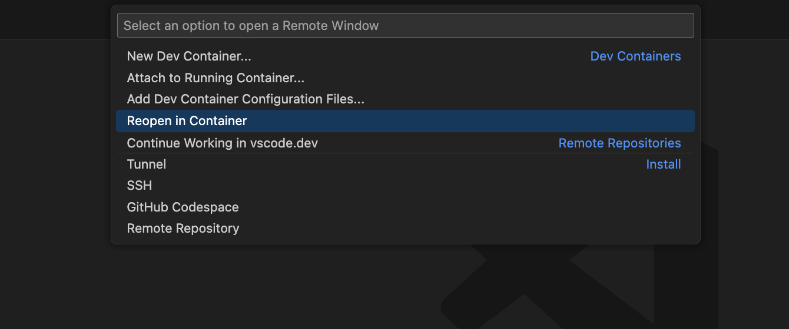

# How to run using Dev Containers

## Install the extension

The Dev Containers extension lets you run Visual Studio Code inside a Docker container.

[Dev Containers extension](vscode:extension/ms-vscode-remote.remote-containers)

### Check installation

With the Dev Containers extension installed, you will see a new Status bar item at the far left.

The Remote Status bar item can quickly show you in which context VS Code is running (local or remote) and clicking on the item will bring up the Dev Containers commands.

Then Finally Select `Reopen in Container`

Congrats!, now follow [how to run project](../README.md#how-to-compile-and-run)